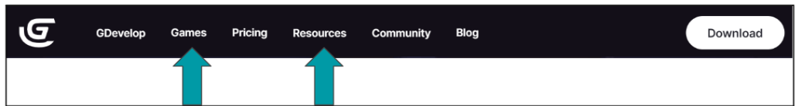
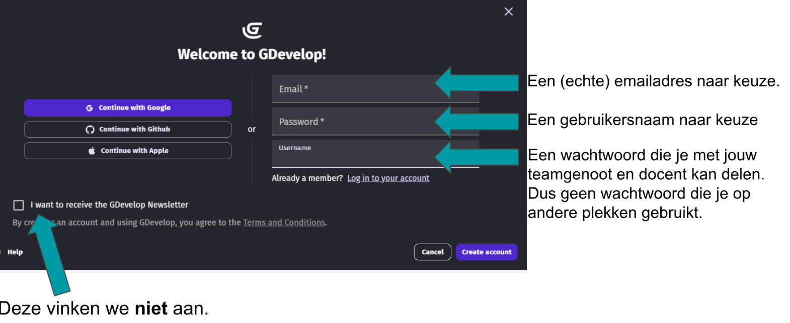

# Opdrachtomschrijving

## Inleiding
Deze periode gaan we onze eigen game ontwikkelen met de game engine ‘GDevelop’.

De website vind je hier: [https://gdevelop.io/]([https://gdevelop.io/])\
De editor vind je hier: [https://editor.gdevelop.io/](https://editor.gdevelop.io/)

Handige tabs op de website zijn ‘Games' (voor inspiratie) en ‘Resources’ (voor tutorials).

In dit project werken we met groepjes van twee en worden we ook als team beoordeeld. Hierbij is het wel van belang dat beide teamgenoten ongeveer evenveel aan de game hebben bijgedragen. Zodra de docent een grote ongelijkheid signaleert dan zal deze hierover met jullie in gesprek gaan. We streven ernaar dat jullie dan samen afspraken maken en toch weer goed kunnen samenwerken. Als dit niet lukt dan zal het leiden tot een individuele beoordeling op basis van jullie individuele bijdragen. Wanneer de samenwerking niet soepel verloopt dan mogen jullie de docent hier zelf ook op aanspreken of mailen, maar doe dit ruim voor de inleverdatum!

## Voorbereiding
Voordat we met GDevelop kunnen beginnen, volgen we de volgende stappen.

### Account aanmaken
Ga naar de GDevelop editor en maak een account aan met de knop: .

Vul dan het volgende scherm in:

Na een paar lessen zullen jullie één van de twee gemaakte accounts moeten kiezen om mee verder te gaan. Jullie kunnen hier dan op samenwaerken. Kies welke dit wordt en ga vervolgens naar de Classroom. hier staat een bestand waarin je jullie gegevens kunnen invullen voor de docent:

### Project aanmaken

## De eerste lessen

## Het groepsproject

### De opdracht

### Het beoordelingsformulier

### Hoe werken we samen in Gdevelop?

### Wat als we er niet uitkomen?

## Inleverinstructies

### Inleveren van de game

## Veel voorkomende problemen met Gdevelop

### Tiled sprites zijn onzichtbaar

### Een error bij het opslaan